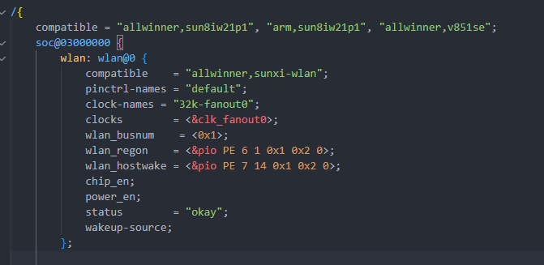
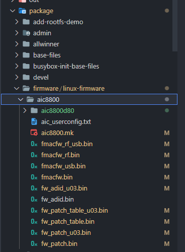
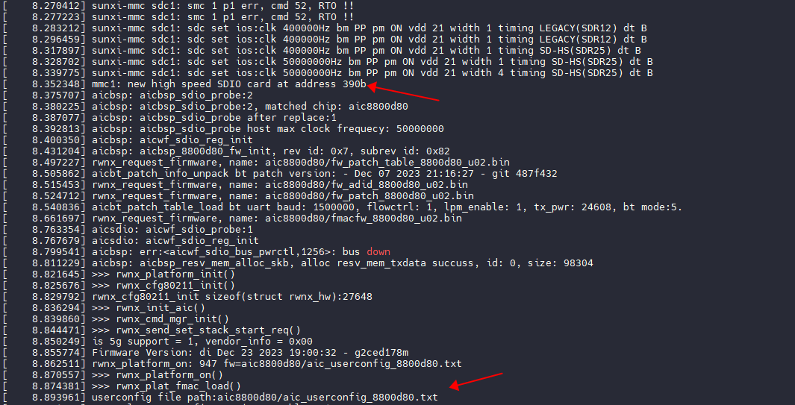

TinyVision 使用GPIO引出WIFI模块，配套的WIFI模块主控芯片为 AIC8800D80

## Linux 4.9 内核驱动移植

### Linux 4.9 BSP 内核驱动

下载驱动后获得驱动的 `tar.gz` 压缩包


解压后找到如下驱动与文件夹


进入内核，找到 `linux-4.9/drivers/net/wireless` 文件夹中，新建文件夹`aic8800` 并且把上面的驱动与文件夹放入刚刚创建好的 `aic8800` 中。


修改 `linux-4.9/drivers/net/wireless/Kconfig` ，增加一行

```c
source "drivers/net/wireless/aic8800/Kconfig"
```


修改 `linux-4.9/drivers/net/wireless/Makefile` ，增加一行

```c
obj-$(CONFIG_AIC_WLAN_SUPPORT) += aic8800/
```


进入内核配置页，找到并勾选如下选项。

```
Device Drivers  --->
	[*] Network device support  --->
		[*]   Wireless LAN  --->
			[*]   AIC wireless Support
				  Enable Chip Interface (SDIO interface support)  --->
			<M>   AIC8800 wlan Support
			<M>   AIC8800 bluetooth Support (UART)
```


编译后可以找到对应的驱动程序


其加载顺序是

```
insmod aic8800_bsp.ko
insmod aic8800_fdrv.ko
insmod aic8800_btlpm.ko
```

### Linux 4.9 BSP 内核设备树

设备树配置如下，参考电路原理图，REG_ON 为 PE6，HOSTWAKE 为 PE7

```dts
wlan: wlan@0 {
	compatible    = "allwinner,sunxi-wlan";
	pinctrl-names = "default";
	clock-names   = "32k-fanout0";
	clocks        = <&clk_fanout0>;
	wlan_busnum   = <0x1>;
	wlan_regon    = <&pio PE 6 1 0x1 0x2 0>;
	wlan_hostwake = <&pio PE 7 14 0x1 0x2 0>;
	chip_en;
	power_en;
	status        = "okay";
	wakeup-source;
};
```



### Tina SDK 移植

Tina SDK 基于OpenWrt 提供了一些自动化方案，可以参考 OpenWrt 的方法来移植这些驱动。

#### WIFI 固件移植

下载得到 `aic8800-firmware.tar.gz` 这里面包含着 WIFI 使用的固件


解压后拷贝到 `package/firmware/linux-firmware/aic8800` 即可



然后找到 `target/allwinner/v851se-common/modules.mk` 文件，在末尾添加如下内容

```makefile
define KernelPackage/net-aic8800
  SUBMENU:=$(WIRELESS_MENU)
  TITLE:=aic8800 support (staging)
  DEPENDS:=+@IPV6 +@USES_AICSEMI
  KCONFIG:=\
    CONFIG_AIC8800_BTLPM_SUPPORT=m \
    CONFIG_AIC8800_WLAN_SUPPORT=m \
    CONFIG_AIC_WLAN_SUPPORT=m \
    CONFIG_PM=y \
    CONFIG_RFKILL=y \
    CONFIG_RFKILL_PM=y \
    CONFIG_RFKILL_GPIO=y

  FILES+=$(LINUX_DIR)/drivers/net/wireless/aic8800/aic8800_bsp/aic8800_bsp.ko
  FILES+=$(LINUX_DIR)/drivers/net/wireless/aic8800/aic8800_btlpm/aic8800_btlpm.ko
  FILES+=$(LINUX_DIR)/drivers/net/wireless/aic8800/aic8800_fdrv/aic8800_fdrv.ko
  AUTOLOAD:=$(call AutoProbe,aic8800_bsp aic8800_btlpm aic8800_fdrv)
endef

define KernelPackage/net-aic8800/description
 Kernel modules for aic8800 support
endef

$(eval $(call KernelPackage,net-aic8800))
```

通过这些内容可以使 Tina 自动去内核文件夹将 ko 打包进文件系统。


#### 配置自动装载模块

修改文件：`target/allwinner/v851se-tinyvision/busybox-init-base-files/etc/init.d/rc.modules` 增加如下内容，每次开机的时候就会自动装载模块

```c
#!/bin/sh
insmod /lib/modules/4.9.191/aic8800_bsp.ko
insmod /lib/modules/4.9.191/aic8800_fdrv.ko
insmod /lib/modules/4.9.191/aic8800_btlpm.ko
```

#### 配置网络进程

新建文件 `target/allwinner/v851se-tinyvision/busybox-init-base-files/etc/init.d/S50wifidaemon` 写入如下内容，每次开机装载模块后便初始化WIFI和配置WIFI模式

```
#!/bin/sh
#
# Start wifi_daemon....
#

start() {
      printf "Starting wifi_daemon....: "
	  wifi_daemon
	  sleep 2
	  wifi -o sta
}

stop() {
	printf "Stopping wifi_daemon: "
}

case "$1" in
    start)
	start
	;;
    stop)
	stop
	;;
    restart|reload)
	stop
	start
	;;
  *)
	echo "Usage: $0 {start|stop|restart}"
	exit 1
esac

exit $?
```

#### 配置 WIFI 固件

进入 Tina 配置页面，打开如下功能

```
Allwinner  --->
	Wireless  --->
		<*> wifimanager-v2.0................................... Tina wifimanager-v2.0
		-*- wirelesscommon............................. Allwinner Wi-Fi/BT Public lib

Firmware  ---> 
	<*> aic8800-firmware.................................... AIC aic8800 firmware

Kernel modules  --->
	Wireless Drivers  --->
		<*> kmod-net-aic8800............................... aic8800 support (staging)
```

### 测试

上电启动，可以看到 LOG 正常挂载 WIFI



可以看到正常初始化进程


## Linux 5.15 内核驱动移植

### Linux 5.15 内核驱动

下载驱动后获得驱动的 `tar.gz` 压缩包


解压后找到如下驱动与文件夹


由于 Linux 5.15 需要保证内核的主线化，不可将非主线的第三方驱动放置于内核文件夹中，所以将驱动放置于 `bsp` 文件夹中。

进入`bsp`，找到 `bsp/drivers/net/wireless` 文件夹中，新建文件夹`aic8800` 并且把上面的驱动与文件夹放入刚刚创建好的 `aic8800` 中。


修改 `bsp/drivers/net/wireless/Kconfig` ，增加一行

```c
source "bsp/drivers/net/wireless/aic8800/Kconfig"
```


修改 `bsp/drivers/net/wireless/Makefile` ，增加一行

```c
obj-$(CONFIG_AIC_WLAN_SUPPORT) += aic8800/
```


 修改 `bsp/drivers/net/wireless/aic8800/Kconfig`，修改为 `bsp` 的索引


```
if AIC_WLAN_SUPPORT
source "bsp/drivers/net/wireless/aic8800/aic8800_fdrv/Kconfig"
source "bsp/drivers/net/wireless/aic8800/aic8800_btlpm/Kconfig"
endif

if AIC_INTF_USB
source "bsp/drivers/net/wireless/aic8800/aic8800_btusb/Kconfig"
endif
```

进入内核配置页，找到并勾选如下选项。

```
[*] Networking support  --->
	<*>   Bluetooth subsystem support  --->
		[*]   Bluetooth Classic (BR/EDR) features (NEW)
		<*>     RFCOMM protocol support
		[*]       RFCOMM TTY support
		[*]   Bluetooth Low Energy (LE) features
		[*]   Export Bluetooth internals in debugfs
			  Bluetooth device drivers  --->
				  <*> HCI UART driver
				  [*]   UART (H4) protocol support
	-*-   Wireless  --->
		<*>   cfg80211 - wireless configuration API
		[ ]     nl80211 testmode command
		[ ]     enable developer warnings
		[ ]     cfg80211 certification onus
		[*]     enable powersave by default
		[ ]     cfg80211 DebugFS entries
		[*]     support CRDA
		[*]     cfg80211 wireless extensions compatibility 
		<*>   Generic IEEE 802.11 Networking Stack (mac80211)
	<*>   RF switch subsystem support  --->
		[*]   RF switch input support
		<*>   GPIO RFKILL driver

Device Drivers  --->
	Network device support  --->
		[*]   Wireless LAN  --->
			[*]   AIC wireless Support
				  Enable Chip Interface (SDIO interface support)  --->
			<M>   AIC8800 wlan Support
			<M>   AIC8800 bluetooth Support (UART)
	Misc Devices Drivers  --->
		<*> Allwinner rfkill driver
		<*> Allwinner Network MAC Addess Manager
```

### Linux 5.15 内核设备树

```
&rfkill {
	compatible = "allwinner,sunxi-rfkill";
	chip_en;
	power_en;
	pinctrl-0;
	pinctrl-names;
	status = "okay";

	/* wlan session */
	wlan {
		compatible    = "allwinner,sunxi-wlan";
		wlan_busnum   = <0x1>;
		wlan_regon    = <&pio PE 6 GPIO_ACTIVE_HIGH>;
		wlan_hostwake = <&pio PE 7 GPIO_ACTIVE_HIGH>;
		wakeup-source;
	};

	/* bt session */
	bt {
		compatible    = "allwinner,sunxi-bt";
		bt_rst_n      = <&pio PE 8 GPIO_ACTIVE_LOW>;
	};
};

&addr_mgt {
	compatible     = "allwinner,sunxi-addr_mgt";
	type_addr_wifi = <0x0>;
	type_addr_bt   = <0x0>;
	type_addr_eth  = <0x0>;
	status         = "okay";
};

&btlpm {
	compatible  = "allwinner,sunxi-btlpm";
	uart_index  = <0x2>;
	bt_wake     = <&pio PE 9 GPIO_ACTIVE_HIGH>;
	bt_hostwake = <&pio PE 10 GPIO_ACTIVE_HIGH>; /* unused */
	wakeup-source;
	status      = "okay";
};
```

编译时可以看到生成的对应的 ko 模块


### 测试

由于 Linux 5.15 不绑定 Tina，所以这里直接使用现成的 `debian rootfs` 来做测试。

使用上面编译出来的内核与ko驱动，并且将固件放置于 rootfs 对应的 `/lib/firmware/` 文件夹中
