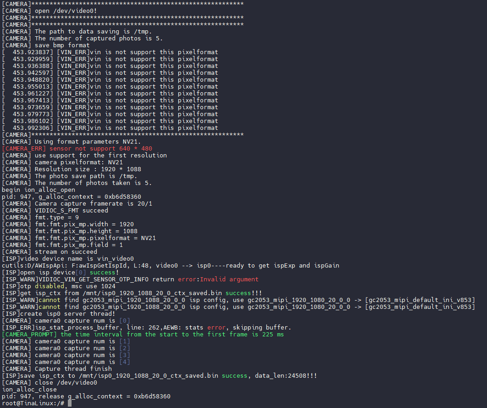
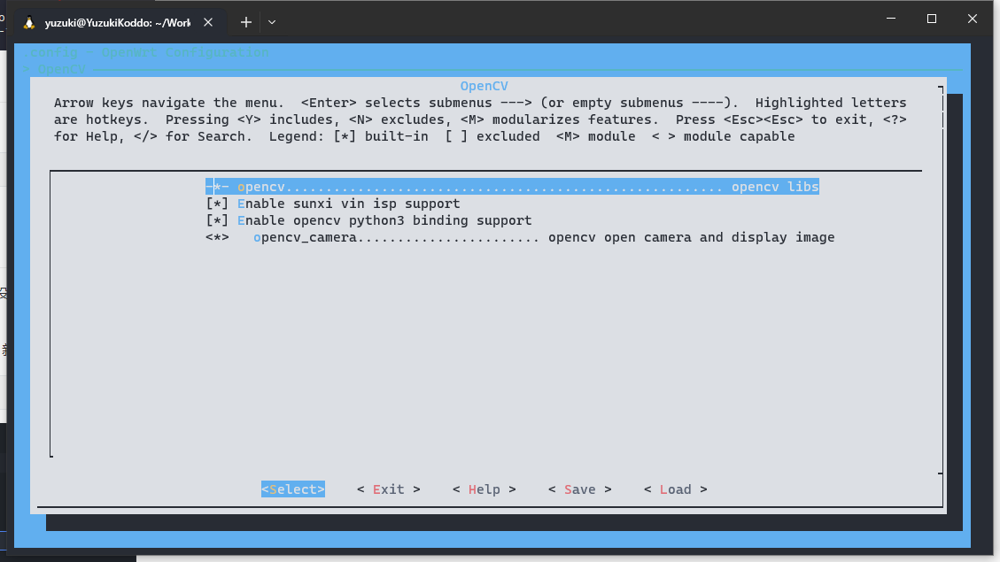

AWOL 版本的 Tina Linux 使用的是 Tina5.0，OpenWrt 升级到了 21.05 版本，相较于商业量产版本的 Tina Linux 新了许多，而且支持更多新软件包。不过可惜的是 MPP 没有移植到 Tina5.0，不过 MPP 使用门槛较高，学习难度大，不是做产品也没必要研究。这里就研究下使用 AWOL 开源版本的 Tina Linux 与 OpenCV 框架开启摄像头拍照捕获视频。

## 准备开发环境

首先准备一台 Ubuntu 20.04 / Ubuntu 18.04 / Ubuntu 16.04 / Ubuntu 14.04 的虚拟机或实体机，其他系统没有测试过出 BUG 不管。

更新系统，安装基础软件包

```
sudo apt-get update
sudo apt-get upgrade -y
sudo apt-get install build-essential subversion git libncurses5-dev zlib1g-dev gawk flex bison quilt libssl-dev xsltproc libxml-parser-perl mercurial bzr ecj cvs unzip lsof python3 python2 python3-dev android-tools-mkbootimg python2 libpython3-dev
```

安装完成后还需要安装 i386 支持，SDK 有几个打包固件使用的程序是 32 位的，如果不安装就等着 `Segment fault` 吧。

```
sudo dpkg --add-architecture i386
sudo apt-get update
sudo apt install gcc-multilib 
sudo apt install libc6:i386 libstdc++6:i386 lib32z1
```

## 下载 AWOL Tina Linux BSP

### 注册一个 AWOL 账号

下载 SDK 需要使用 AWOL 的账号，前往 `https://bbs.aw-ol.com/` 注册一个就行。其中需要账号等级为 LV2，可以去这个帖子：https://bbs.aw-ol.com/topic/4158/share/1 水四条回复就有 LV2 等级了。

### 安装 repo 管理器

BSP 使用 `repo` 下载，首先安装 `repo `，这里建议使用国内镜像源安装

```bash
mkdir -p ~/.bin
PATH="${HOME}/.bin:${PATH}"
curl https://mirrors.bfsu.edu.cn/git/git-repo > ~/.bin/repo
chmod a+rx ~/.bin/repo
```

请注意这里使用的是临时安装，安装完成后重启终端就没有了，需要再次运行下面的命令才能使用，如何永久安装请自行百度。

```bash
PATH="${HOME}/.bin:${PATH}"
```

安装使用 `repo` 的过程中会遇到各种错误，请百度解决。repo 是谷歌开发的，repo 的官方服务器是谷歌的服务器，repo 每次运行时需要检查更新然后卡死，这是很正常的情况，所以在国内需要更换镜像源提高下载速度。将如下内容复制到你的`~/.bashrc` 里

```bash
echo export REPO_URL='https://mirrors.bfsu.edu.cn/git/git-repo' >> ~/.bashrc
source ~/.bashrc
```

如果您使用的是 dash、hash、 zsh 等 shell，请参照 shell 的文档配置。环境变量配置一个 `REPO_URL` 的地址

配置一下 git 身份认证，设置保存 git 账号密码不用每次都输入。

```bash
git config --global credential.helper store
```

### 新建文件夹保存 SDK

使用 `mkdir` 命令新建文件夹，保存之后需要拉取的 SDK，然后 `cd` 进入到刚才新建的文件夹中。

```bash
mkdir tina-v853-open
cd tina-v853-open
```

### 初始化 repo 仓库

使用 `repo init` 命令初始化仓库，`tina-d1-h` 的仓库地址是 `https://sdk.aw-ol.com/git_repo/V853Tina_Open/manifest.git` 需要执行命令：

```bash
repo init -u https://sdk.aw-ol.com/git_repo/V853Tina_Open/manifest.git -b master -m tina-v853-open.xml
```

### 拉取 SDK

```bash
repo sync
```

### 创建开发环境

```bash
repo start devboard-v853-tina-for-awol --all
```

## 适配 TinyVision 板子

刚才下载到的 SDK 只支持一个板子，售价 1999 的 `V853-Vision`  开发板，这里要添加自己的板子的适配。

下载支持包：https://github.com/YuzukiTsuru/YuzukiTsuru.GitHub.io/releases/download/2024-01-21-20240121/tina-bsp-tinyvision.tar.gz

或者可以在：https://github.com/YuzukiHD/TinyVision/tree/main/tina 下载到文件，不过这部分没预先下载软件包到 dl 文件夹所以编译的时候需要手动下载。

放到 SDK 的主目录下


运行解压指令

``` bash
tar xvf tina-bsp-tinyvision.tar.gz
```

即可使 Tina SDK 支持 TinyVision 板子


## 初始化 SDK 环境

每次开发之前都需要初始化 SDK 环境，命令如下

```
source build/envsetup.sh
```

然后按 1 选择 TinyVision


## 适配 ISP 

Tina SDK 内置一个 libAWispApi 的包，支持在用户层对接 ISP，但是很可惜这个包没有适配 V85x 系列，这里就需要自行适配。其实适配很简单，SDK 已经提供了 lib 只是没提供编译支持。我们需要加上这个支持。

前往 `openwrt/package/allwinner/vision/libAWIspApi/machinfo` 文件夹中，新建一个文件夹 `v851se` ，然后新建文件 `build.mk` 写入如下配置：

``` 
ISP_DIR:=isp600
```


对于  v851s，v853 也可以这样操作，然后 `m menuconfig` 勾选上这个包


## 开启 camerademo 测试摄像头

进入 `m menuconfig` 进入如下页面进行配置。

```
Allwinner  --->
	Vision  --->
		<*> camerademo........................................ camerademo test sensor  --->
			[*]   Enabel vin isp support
```

编译系统然后烧录系统，运行命令 `camerademo` ，可以看到是正常拍摄照片的



## 适配 OpenCV 

### 勾选 OpenCV 包

`m menuconfig` 进入软件包配置，勾选 

```
OpenCV  --->
	<*> opencv....................................................... opencv libs
	[*]   Enabel sunxi vin isp support
```

### OpenCV 适配过程

**本部分的操作已经包含在 tina-bsp-tinyvision.tar.gz 中了，已经适配好了，如果不想了解如何适配 OpenCV 可以直接跳过这部分**

#### OpenCV 的多平面视频捕获支持

一般来说，如果不适配 OpenCV 直接开摄像头，会得到一个报错：

```
[  702.464977] [VIN_ERR]video0 has already stream off
[  702.473357] [VIN_ERR]gc2053_mipi is not used, video0 cannot be close!
VIDEOIO ERROR: V4L2: Unable to capture video memory.VIDEOIO ERROR: V4L: can't open camera by index 0
/dev/video0 does not support memory mapping
Could not open video device.
```

这是由于 OpenCV 的 V4L2 实现是使用的 `V4L2_CAP_VIDEO_CAPTURE` 标准，而 `sunxi-vin` 驱动的 RAW Sensor 平台使用的是 `V4L2_BUF_TYPE_VIDEO_CAPTURE_MPLANE` ，导致了默认 OpenCV 的配置错误。

`V4L2_CAP_VIDEO_CAPTURE_MPLANE`和`V4L2_BUF_TYPE_VIDEO_CAPTURE`是 Video4Linux2（V4L2）框架中用于视频捕获的不同类型和能力标志。

1. `V4L2_CAP_VIDEO_CAPTURE_MPLANE`： 这个标志指示设备支持多平面（multi-plane）视频捕获。在多平面捕获中，图像数据可以分解成多个平面（planes），每个平面包含不同的颜色分量或者图像数据的不同部分。这种方式可以提高效率和灵活性，尤其适用于处理涉及多个颜色分量或者多个图像通道的视频流。
2. `V4L2_BUF_TYPE_VIDEO_CAPTURE`： 这个类型表示普通的单平面（single-plane）视频捕获。在单平面捕获中，图像数据以单个平面的形式存储，即所有的颜色分量或者图像数据都保存在一个平面中。

因此，区别在于支持的数据格式和存储方式。`V4L2_CAP_VIDEO_CAPTURE_MPLANE`表示设备支持多平面视频捕获，而`V4L2_BUF_TYPE_VIDEO_CAPTURE`表示普通的单平面视频捕获。

这里就需要通过检查`capability.capabilities`中是否包含`V4L2_CAP_VIDEO_CAPTURE`标志来确定是否支持普通的视频捕获类型。如果支持，那么将`type`设置为`V4L2_BUF_TYPE_VIDEO_CAPTURE`。

如果不支持普通的视频捕获类型，那么通过检查`capability.capabilities`中是否包含`V4L2_CAP_VIDEO_CAPTURE_MPLANE`标志来确定是否支持多平面视频捕获类型。如果支持，那么将`type`设置为`V4L2_BUF_TYPE_VIDEO_CAPTURE_MPLANE`。

例如如下修改：

```diff
-    form.type                = V4L2_BUF_TYPE_VIDEO_CAPTURE;
-    form.fmt.pix.pixelformat = palette;
-    form.fmt.pix.field       = V4L2_FIELD_ANY;
-    form.fmt.pix.width       = width;
-    form.fmt.pix.height      = height;
+    if (capability.capabilities & V4L2_CAP_VIDEO_CAPTURE) {
+		form.type                = V4L2_BUF_TYPE_VIDEO_CAPTURE;
+		form.fmt.pix.pixelformat = palette;
+		form.fmt.pix.field       = V4L2_FIELD_NONE;
+		form.fmt.pix.width       = width;
+		form.fmt.pix.height      = height;
+	} else if (capability.capabilities & V4L2_CAP_VIDEO_CAPTURE_MPLANE) {
+        form.type = V4L2_BUF_TYPE_VIDEO_CAPTURE_MPLANE;
+        form.fmt.pix_mp.width = width;
+        form.fmt.pix_mp.height = height;
+        form.fmt.pix_mp.pixelformat = palette;
+        form.fmt.pix_mp.field = V4L2_FIELD_NONE;
+	}
```

这段代码是在设置视频捕获的格式和参数时进行了修改。

原来的代码中，直接设置了`form.type`为`V4L2_BUF_TYPE_VIDEO_CAPTURE`，表示使用普通的视频捕获类型。然后设置了其他参数，如像素格式(`pixelformat`)、帧字段(`field`)、宽度(`width`)和高度(`height`)等。

修改后的代码进行了条件判断，根据设备的能力选择合适的视频捕获类型。如果设备支持普通的视频捕获类型（`V4L2_CAP_VIDEO_CAPTURE`标志被设置），则使用普通的视频捕获类型并设置相应的参数。如果设备支持多平面视频捕获类型（`V4L2_CAP_VIDEO_CAPTURE_MPLANE`标志被设置），则使用多平面视频捕获类型并设置相应的参数。

对于普通的视频捕获类型，设置的参数与原来的代码一致，只是将帧字段(`field`)从`V4L2_FIELD_ANY`改为`V4L2_FIELD_NONE`，表示不指定特定的帧字段。

对于多平面视频捕获类型，设置了新的参数，如多平面的宽度(`pix_mp.width`)、高度(`pix_mp.height`)、像素格式(`pix_mp.pixelformat`)和帧字段(`pix_mp.field`)等。

通过这个修改，可以根据设备的能力选择适当的视频捕获类型，并设置相应的参数，以满足不同设备的要求。

#### OpenCV 的 ISP 支持

OpenCV 默认不支持开启 RAW Sensor，不过现在需要配置为 OpenCV 开启 RAW Sensor 抓图，然后通过 OpenCV 送图到之前适配的 libAWispApi 库进行 ISP 处理。在这里增加一个函数作为 RAW Sensor 抓图的处理。

```c++
#ifdef __USE_VIN_ISP__
bool CvCaptureCAM_V4L::RAWSensor()
{
    struct v4l2_control ctrl;
    struct v4l2_queryctrl qc_ctrl;

    memset(&ctrl, 0, sizeof(struct v4l2_control));
    memset(&qc_ctrl, 0, sizeof(struct v4l2_queryctrl));
    ctrl.id = V4L2_CID_SENSOR_TYPE;
    qc_ctrl.id = V4L2_CID_SENSOR_TYPE;

    if (-1 == ioctl (deviceHandle, VIDIOC_QUERYCTRL, &qc_ctrl)){
        fprintf(stderr, "V4L2: %s QUERY V4L2_CID_SENSOR_TYPE failed\n", deviceName.c_str());
        return false;
    }

    if (-1 == ioctl(deviceHandle, VIDIOC_G_CTRL, &ctrl)) {
        fprintf(stderr, "V4L2: %s G_CTRL V4L2_CID_SENSOR_TYPE failed\n", deviceName.c_str());
        return false;
    }

    return ctrl.value == V4L2_SENSOR_TYPE_RAW;
}
#endif
```

这段代码的功能是检查V4L2摄像头设备的传感器类型是否为RAW格式。它使用了V4L2的ioctl函数来查询和获取传感器类型信息。具体步骤如下：

1. 定义了两个v4l2_control结构体变量`ctrl`和`qc_ctrl`，并初始化为零
2. 将`ctrl.id`和`qc_ctrl.id`分别设置为`V4L2_CID_SENSOR_TYPE`，表示要查询的控制和查询ID
3. 使用`ioctl`函数的VIDIOC_QUERYCTRL命令来查询传感器类型的控制信息，并将结果保存在`qc_ctrl`中
4. 如果查询失败（`ioctl`返回-1），则输出错误信息并返回false
5. 使用`ioctl`函数的VIDIOC_G_CTRL命令来获取传感器类型的当前值，并将结果保存在`ctrl`中
6. 如果获取失败（`ioctl`返回-1），则输出错误信息并返回false
7. 检查`ctrl.value`是否等于`V4L2_SENSOR_TYPE_RAW`，如果相等，则返回true，表示传感器类型为RAW格式；否则返回false

并且使用了`#ifdef __USE_VIN_ISP__`指令。这表示只有在定义了`__USE_VIN_ISP__`宏时，才会编译和执行这段代码

然后在 OpenCV 的 ` bool CvCaptureCAM_V4L::streaming(bool startStream)` 捕获流函数中添加 ISP 处理

```c++
#ifdef __USE_VIN_ISP__
	RawSensor = RAWSensor();

	if (startStream && RawSensor) {
		int VideoIndex = -1;

		sscanf(deviceName.c_str(), "/dev/video%d", &VideoIndex);

		IspPort = CreateAWIspApi();
		IspId = -1;
		IspId = IspPort->ispGetIspId(VideoIndex);
		if (IspId >= 0)
			IspPort->ispStart(IspId);
	} else if (RawSensor && IspId >= 0 && IspPort) {
		IspPort->ispStop(IspId);
		DestroyAWIspApi(IspPort);
		IspPort = NULL;
		IspId = -1;
	}
#endif
```

这段代码是在条件编译`__USE_VIN_ISP__`的情况下进行了修改。

- 首先，它创建了一个`RawSensor`对象，并检查`startStream`和`RawSensor`是否为真。如果满足条件，接下来会解析设备名称字符串，提取出视频索引号。

- 然后，它调用`CreateAWIspApi()`函数创建了一个AWIspApi对象，并初始化变量`IspId`为-1。接着，通过调用`ispGetIspId()`函数获取指定视频索引号对应的ISP ID，并将其赋值给`IspId`。如果`IspId`大于等于0，表示获取到有效的ISP ID，就调用`ispStart()`函数启动ISP流处理。

- 如果不满足第一个条件，即`startStream`为假或者没有`RawSensor`对象，那么会检查`IspId`是否大于等于0并且`IspPort`对象是否存在。如果满足这些条件，说明之前已经启动了ISP流处理，此时会调用`ispStop()`函数停止ISP流处理，并销毁`IspPort`对象。最后，将`IspPort`置为空指针，将`IspId`重置为-1。

这段代码主要用于控制图像信号处理（ISP）的启动和停止。根据条件的不同，可以选择在开始视频流捕获时启动ISP流处理，或者在停止视频流捕获时停止ISP流处理，以便对视频数据进行处理和增强。

至于其他包括编译脚本的修改，全局变量定义等操作，可以参考补丁文件 `openwrt/package/thirdparty/vision/opencv/patches/0004-support-sunxi-vin-camera.patch` 

## 使用 OpenCV 捕获摄像头并且输出到屏幕上

### 快速测试

这个 DEMO 也已经包含在 tina-bsp-tinyvision.tar.gz 中了，可以快速测试这个 DEMO

运行 `m menuconfig`

```
OpenCV  --->
	<*> opencv....................................................... opencv libs
	[*]   Enabel sunxi vin isp support
	<*> opencv_camera.............................opencv_camera and display image
```

### 源码详解

编写一个程序，使用 OpenCV 捕获摄像头输出并且显示到屏幕上，程序如下：

```c++
#include <fcntl.h>
#include <fstream>
#include <iostream>
#include <linux/fb.h>
#include <signal.h>
#include <stdint.h>
#include <sys/ioctl.h>

#include <opencv2/opencv.hpp>

#define DISPLAY_X 240
#define DISPLAY_Y 240

static cv::VideoCapture cap;

struct framebuffer_info {
    uint32_t bits_per_pixel;
    uint32_t xres_virtual;
};

struct framebuffer_info get_framebuffer_info(const char* framebuffer_device_path)
{
    struct framebuffer_info info;
    struct fb_var_screeninfo screen_info;
    int fd = -1;
    fd = open(framebuffer_device_path, O_RDWR);
    if (fd >= 0) {
        if (!ioctl(fd, FBIOGET_VSCREENINFO, &screen_info)) {
            info.xres_virtual = screen_info.xres_virtual;
            info.bits_per_pixel = screen_info.bits_per_pixel;
        }
    }
    return info;
};

/* Signal handler */
static void terminate(int sig_no)
{
    printf("Got signal %d, exiting ...\n", sig_no);
    cap.release();
    exit(1);
}

static void install_sig_handler(void)
{
    signal(SIGBUS, terminate);
    signal(SIGFPE, terminate);
    signal(SIGHUP, terminate);
    signal(SIGILL, terminate);
    signal(SIGINT, terminate);
    signal(SIGIOT, terminate);
    signal(SIGPIPE, terminate);
    signal(SIGQUIT, terminate);
    signal(SIGSEGV, terminate);
    signal(SIGSYS, terminate);
    signal(SIGTERM, terminate);
    signal(SIGTRAP, terminate);
    signal(SIGUSR1, terminate);
    signal(SIGUSR2, terminate);
}

int main(int, char**)
{
    const int frame_width = 480;
    const int frame_height = 480;
    const int frame_rate = 30;

    install_sig_handler();

    framebuffer_info fb_info = get_framebuffer_info("/dev/fb0");

    cap.open(0);

    if (!cap.isOpened()) {
        std::cerr << "Could not open video device." << std::endl;
        return 1;
    }

    std::cout << "Successfully opened video device." << std::endl;
    cap.set(cv::CAP_PROP_FRAME_WIDTH, frame_width);
    cap.set(cv::CAP_PROP_FRAME_HEIGHT, frame_height);
    cap.set(cv::CAP_PROP_FPS, frame_rate);

    std::ofstream ofs("/dev/fb0");

    cv::Mat frame;
    cv::Mat trams_temp_fream;
    cv::Mat yuv_frame;

    while (true) {
        cap >> frame;
        if (frame.depth() != CV_8U) {
            std::cerr << "Not 8 bits per pixel and channel." << std::endl;
        } else if (frame.channels() != 3) {
            std::cerr << "Not 3 channels." << std::endl;
        } else {
            cv::transpose(frame, frame);
            cv::flip(frame, frame, 0);
            cv::resize(frame, frame, cv::Size(DISPLAY_X, DISPLAY_Y));
            int framebuffer_width = fb_info.xres_virtual;
            int framebuffer_depth = fb_info.bits_per_pixel;
            cv::Size2f frame_size = frame.size();
            cv::Mat framebuffer_compat;
            switch (framebuffer_depth) {
            case 16:
                cv::cvtColor(frame, framebuffer_compat, cv::COLOR_BGR2BGR565);
                for (int y = 0; y < frame_size.height; y++) {
                    ofs.seekp(y * framebuffer_width * 2);
                    ofs.write(reinterpret_cast<char*>(framebuffer_compat.ptr(y)), frame_size.width * 2);
                }
                break;
            case 32: {
                std::vector<cv::Mat> split_bgr;
                cv::split(frame, split_bgr);
                split_bgr.push_back(cv::Mat(frame_size, CV_8UC1, cv::Scalar(255)));
                cv::merge(split_bgr, framebuffer_compat);
                for (int y = 0; y < frame_size.height; y++) {
                    ofs.seekp(y * framebuffer_width * 4);
                    ofs.write(reinterpret_cast<char*>(framebuffer_compat.ptr(y)), frame_size.width * 4);
                }
            } break;
            default:
                std::cerr << "Unsupported depth of framebuffer." << std::endl;
            }
        }
    }
}
```

第一部分，处理 frame_buffer 信息：

```c++
// 引入头文件
#include <fcntl.h>
#include <fstream>
#include <iostream>
#include <linux/fb.h>
#include <signal.h>
#include <stdint.h>
#include <sys/ioctl.h>

#include <opencv2/opencv.hpp>

// 定义显示屏宽度和高度
#define DISPLAY_X 240
#define DISPLAY_Y 240

static cv::VideoCapture cap; // 视频流捕获对象

// 帧缓冲信息结构体
struct framebuffer_info {
    uint32_t bits_per_pixel; // 每个像素的位数
    uint32_t xres_virtual; // 虚拟屏幕的宽度
};

// 获取帧缓冲信息函数
struct framebuffer_info get_framebuffer_info(const char* framebuffer_device_path)
{
    struct framebuffer_info info;
    struct fb_var_screeninfo screen_info;
    int fd = -1;

    // 打开帧缓冲设备文件
    fd = open(framebuffer_device_path, O_RDWR);
    if (fd >= 0) {
        // 通过 ioctl 获取屏幕信息
        if (!ioctl(fd, FBIOGET_VSCREENINFO, &screen_info)) {
            info.xres_virtual = screen_info.xres_virtual; // 虚拟屏幕的宽度
            info.bits_per_pixel = screen_info.bits_per_pixel; // 每个像素的位数
        }
    }
    return info;
}
```

这段代码定义了一些常量、全局变量以及两个函数，并给出了相应的注释说明。具体注释如下：

- `#define DISPLAY_X 240`：定义显示屏的宽度为240。
- `#define DISPLAY_Y 240`：定义显示屏的高度为240。
- `static cv::VideoCapture cap;`：定义一个静态的OpenCV视频流捕获对象，用于捕获视频流。
- `struct framebuffer_info`：定义了一个帧缓冲信息的结构体。
  - `uint32_t bits_per_pixel`：每个像素的位数。
  - `uint32_t xres_virtual`：虚拟屏幕的宽度。
- `struct framebuffer_info get_framebuffer_info(const char* framebuffer_device_path)`：获取帧缓冲信息的函数。
  - `const char* framebuffer_device_path`：帧缓冲设备文件的路径。
  - `int fd = -1;`：初始化文件描述符为-1。
  - `fd = open(framebuffer_device_path, O_RDWR);`：打开帧缓冲设备文件，并将文件描述符保存在变量`fd`中。
  - `if (fd >= 0)`：检查文件是否成功打开。
  - `if (!ioctl(fd, FBIOGET_VSCREENINFO, &screen_info))`：通过ioctl获取屏幕信息，并将信息保存在变量`screen_info`中。
    - `FBIOGET_VSCREENINFO`：控制命令，用于获取屏幕信息。
    - `&screen_info`：屏幕信息结构体的指针。
  - `info.xres_virtual = screen_info.xres_virtual;`：将屏幕的虚拟宽度保存在帧缓冲信息结构体的字段`xres_virtual`中。
  - `info.bits_per_pixel = screen_info.bits_per_pixel;`：将每个像素的位数保存在帧缓冲信息结构体的字段`bits_per_pixel`中。
  - `return info;`：返回帧缓冲信息结构体。

第二部分，注册信号处理函数，用于 `ctrl-c` 之后关闭摄像头，防止下一次使用摄像头出现摄像头仍被占用的情况。

```c++
/* Signal handler */
static void terminate(int sig_no)
{
    printf("Got signal %d, exiting ...\n", sig_no);
    cap.release();
    exit(1);
}

static void install_sig_handler(void)
{
    signal(SIGBUS, terminate); // 当程序访问一个不合法的内存地址时发送的信号
    signal(SIGFPE, terminate); // 浮点异常信号
    signal(SIGHUP, terminate); // 终端断开连接信号
    signal(SIGILL, terminate); // 非法指令信号
    signal(SIGINT, terminate); // 中断进程信号
    signal(SIGIOT, terminate); // IOT 陷阱信号
    signal(SIGPIPE, terminate); // 管道破裂信号
    signal(SIGQUIT, terminate); // 停止进程信号
    signal(SIGSEGV, terminate); // 无效的内存引用信号
    signal(SIGSYS, terminate); // 非法系统调用信号
    signal(SIGTERM, terminate); // 终止进程信号
    signal(SIGTRAP, terminate); // 跟踪/断点陷阱信号
    signal(SIGUSR1, terminate); // 用户定义信号1
    signal(SIGUSR2, terminate); // 用户定义信号2
}
```

这段代码定义了两个函数，并给出了相应的注释说明。具体注释如下：

- `static void terminate(int sig_no)`：信号处理函数。
  - `int sig_no`：接收到的信号编号。
  - `printf("Got signal %d, exiting ...\n", sig_no);`：打印接收到的信号编号。
  - `cap.release();`：释放视频流捕获对象。
  - `exit(1);`：退出程序。
- `static void install_sig_handler(void)`：安装信号处理函数。
  - `signal(SIGBUS, terminate);`：为SIGBUS信号安装信号处理函数。
  - `signal(SIGFPE, terminate);`：为SIGFPE信号安装信号处理函数。
  - `signal(SIGHUP, terminate);`：为SIGHUP信号安装信号处理函数。
  - `signal(SIGILL, terminate);`：为SIGILL信号安装信号处理函数。
  - `signal(SIGINT, terminate);`：为SIGINT信号安装信号处理函数。
  - `signal(SIGIOT, terminate);`：为SIGIOT信号安装信号处理函数。
  - `signal(SIGPIPE, terminate);`：为SIGPIPE信号安装信号处理函数。
  - `signal(SIGQUIT, terminate);`：为SIGQUIT信号安装信号处理函数。
  - `signal(SIGSEGV, terminate);`：为SIGSEGV信号安装信号处理函数。
  - `signal(SIGSYS, terminate);`：为SIGSYS信号安装信号处理函数。
  - `signal(SIGTERM, terminate);`：为SIGTERM信号安装信号处理函数。
  - `signal(SIGTRAP, terminate);`：为SIGTRAP信号安装信号处理函数。
  - `signal(SIGUSR1, terminate);`：为SIGUSR1信号安装信号处理函数。
  - `signal(SIGUSR2, terminate);`：为SIGUSR2信号安装信号处理函数。

这段代码的功能是安装信号处理函数，用于捕获和处理不同类型的信号。当程序接收到指定的信号时，会调用`terminate`函数进行处理。

具体而言，`terminate`函数会打印接收到的信号编号，并释放视频流捕获对象`cap`，然后调用`exit(1)`退出程序。

`install_sig_handler`函数用于为多个信号注册同一个信号处理函数`terminate`，使得当这些信号触发时，都会执行相同的处理逻辑。

第三部分，主函数：

```c++
int main(int, char**)
{
    const int frame_width = 480;
    const int frame_height = 480;
    const int frame_rate = 30;

    install_sig_handler(); // 安装信号处理函数

    framebuffer_info fb_info = get_framebuffer_info("/dev/fb0"); // 获取帧缓冲区信息

    cap.open(0); // 打开摄像头

    if (!cap.isOpened()) {
        std::cerr << "Could not open video device." << std::endl;
        return 1;
    }

    std::cout << "Successfully opened video device." << std::endl;
    cap.set(cv::CAP_PROP_FRAME_WIDTH, frame_width);
    cap.set(cv::CAP_PROP_FRAME_HEIGHT, frame_height);
    cap.set(cv::CAP_PROP_FPS, frame_rate);

    std::ofstream ofs("/dev/fb0"); // 打开帧缓冲区

    cv::Mat frame;
    cv::Mat trams_temp_fream;
    cv::Mat yuv_frame;

    while (true) {
        cap >> frame; // 读取一帧图像
        if (frame.depth() != CV_8U) { // 判断是否为8位每通道像素
            std::cerr << "Not 8 bits per pixel and channel." << std::endl;
        } else if (frame.channels() != 3) { // 判断是否为3通道
            std::cerr << "Not 3 channels." << std::endl;
        } else {
            cv::transpose(frame, frame); // 图像转置
            cv::flip(frame, frame, 0); // 图像翻转
            cv::resize(frame, frame, cv::Size(DISPLAY_X, DISPLAY_Y)); // 改变图像大小
            int framebuffer_width = fb_info.xres_virtual;
            int framebuffer_depth = fb_info.bits_per_pixel;
            cv::Size2f frame_size = frame.size();
            cv::Mat framebuffer_compat;
            switch (framebuffer_depth) {
            case 16:
                cv::cvtColor(frame, framebuffer_compat, cv::COLOR_BGR2BGR565);
                for (int y = 0; y < frame_size.height; y++) {
                    ofs.seekp(y * framebuffer_width * 2);
                    ofs.write(reinterpret_cast<char*>(framebuffer_compat.ptr(y)), frame_size.width * 2);
                }
                break;
            case 32: {
                std::vector<cv::Mat> split_bgr;
                cv::split(frame, split_bgr);
                split_bgr.push_back(cv::Mat(frame_size, CV_8UC1, cv::Scalar(255)));
                cv::merge(split_bgr, framebuffer_compat);
                for (int y = 0; y < frame_size.height; y++) {
                    ofs.seekp(y * framebuffer_width * 4);
                    ofs.write(reinterpret_cast<char*>(framebuffer_compat.ptr(y)), frame_size.width * 4);
                }
            } break;
            default:
                std::cerr << "Unsupported depth of framebuffer." << std::endl;
            }
        }
    }

    return 0;
}
```

这段代码主要实现了从摄像头获取图像并将其显示在帧缓冲区中。具体流程如下：

- 定义了常量`frame_width`、`frame_height`和`frame_rate`表示图像的宽度、高度和帧率。
- 调用`install_sig_handler()`函数安装信号处理函数。
- 调用`get_framebuffer_info("/dev/fb0")`函数获取帧缓冲区信息。
- 调用`cap.open(0)`打开摄像头，并进行错误检查。
- 调用`cap.set()`函数设置摄像头的参数。
- 调用`std::ofstream ofs("/dev/fb0")`打开帧缓冲区。
- 循环读取摄像头的每一帧图像，对其进行转置、翻转、缩放等操作，然后将其写入帧缓冲区中。

如果读取的图像不是8位每通道像素或者不是3通道，则会输出错误信息。如果帧缓冲区的深度不受支持，则也会输出错误信息。

## 使用 Python3 操作 OpenCV

### 勾选 OpenCV-Python3 包

`m menuconfig` 进入软件包配置，勾选 

```
OpenCV  --->
	<*> opencv....................................................... opencv libs
	[*]   Enabel sunxi vin isp support
	[*]   Enabel opencv python3 binding support
```



然后编译固件即可，请注意 Python3 编译非常慢，需要耐心等待下。

编写一个 Python 脚本，执行上面的相同操作

```python
import cv2
import numpy as np
import fcntl

frame_width = 480
frame_height = 480
frame_rate = 30

# 打开摄像头
cap = cv2.VideoCapture(0)
cap.set(cv2.CAP_PROP_FRAME_WIDTH, frame_width)
cap.set(cv2.CAP_PROP_FRAME_HEIGHT, frame_height)
cap.set(cv2.CAP_PROP_FPS, frame_rate)

# 打开帧缓冲区
fb_file = open('/dev/fb0', 'wb')
fb_file.seek(0)

while True:
    # 读取一帧图像
    ret, frame = cap.read()
    if not ret:
        print("Failed to read video device.")
        break
    
    # 对图像进行转置、翻转和缩放操作
    frame = cv2.transpose(frame)
    frame = cv2.flip(frame, 0)
    frame = cv2.resize(frame, (frame_width, frame_height))
    
    # 定义帧缓冲区参数
    framebuffer_width = frame_width
    framebuffer_depth = 32
    frame_size = (frame_width, frame_height)
    
    # 将图像转换为4通道BGR格式
    split_bgr = cv2.split(frame)
    split_bgr.append(np.ones((frame_height, frame_width), dtype=np.uint8) * 255)
    framebuffer_compat = cv2.merge(split_bgr)
    
    # 将图像写入帧缓冲区
    if framebuffer_depth == 16:
        framebuffer_compat = cv2.cvtColor(framebuffer_compat, cv2.COLOR_BGR2BGR565)
        fb_file.write(framebuffer_compat.tobytes())
    elif framebuffer_depth == 32:
        fb_file.write(framebuffer_compat.tobytes())
    else:
        print("Unsupported depth of framebuffer.")
        break
        
# 释放摄像头
cap.release()
cv2.destroyAllWindows()

# 关闭帧缓冲区
fb_file.close()
```

## 编译系统

初始化 SDK 环境。

```
source build/envsetup.sh
```

然后就是编译 SDK 输出固件

```
mp -j32
```

如果出现错误，请再次运行 

```
mp -j1 V=s 
```

以单线程编译解决依赖关系，并且输出全部编译 LOG 方便排查错误。

## 线刷固件

### 修改 U-boot 支持线刷固件

U-Boot 默认配置的是使用 SDC2 也就是 TinyVision 的 SD-NAND 刷写固件。同时也支持使用 SDC0 也就是 TF 卡烧写固件，但是需要手动配置一下 U-Boot。否则会出现如下问题，U-Boot 去初始化不存在的 SD NAND 导致刷不进系统。


前往文件夹 `brandy/brandy-2.0/u-boot-2018/drivers/sunxi_flash/mmc/sdmmc.c` 

找到第 188 行，将 `return sdmmc_init_for_sprite(0, 2);` 修改为 `return sdmmc_init_for_sprite(0, 0);`


修改后需要重新编译固件。插入空白的 TF 卡，如果不是空白的 TF 卡可能出现芯片不进入烧录模式。


出现 `try card 0` 开始下载到 TF 卡内