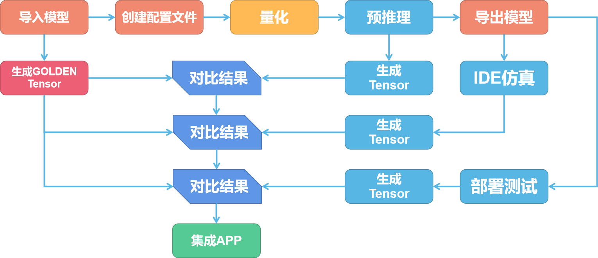
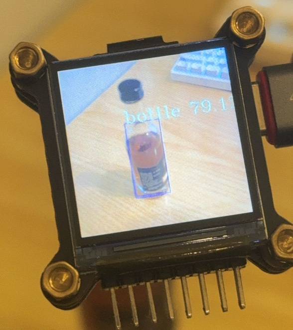

TinyVision V851s 使用 OpenCV + NPU 实现 Mobilenet v2 物体识别。上一篇已经介绍了如何使用 TinyVision 与 OpenCV 开摄像头，本篇将使用已经训练完成并且转换后的模型来介绍对接 NPU 实现物体识别的功能。

# MobileNet V2 

MobileNet V2是一种轻量级的卷积神经网络（CNN）架构，专门设计用于在移动设备和嵌入式设备上进行计算资源受限的实时图像分类和目标检测任务。

以下是MobileNet V2的一些关键特点和创新之处：

1. Depthwise Separable Convolution（深度可分离卷积）：MobileNet V2使用了深度可分离卷积，将标准卷积分解为两个步骤：depthwise convolution（深度卷积）和pointwise convolution（逐点卷积）。这种分解方式可以显著减少计算量和参数数量，从而提高模型的轻量化程度。

2. Inverted Residuals with Linear Bottlenecks（带线性瓶颈的倒残差结构）：MobileNet V2引入了带有线性瓶颈的倒残差结构，以增加模型的非线性表示能力。这种结构在每个残差块的中间层采用较低维度的逐点卷积来减少计算量，并使用扩张卷积来增加感受野，使网络能够更好地捕捉图像中的细节和全局信息。

3. Width Multiplier（宽度乘数）：MobileNet V2提供了一个宽度乘数参数，可以根据计算资源的限制来调整模型的宽度。通过减少每个层的通道数，可以进一步减小模型的体积和计算量，适应不同的设备和应用场景。

4. Linear Bottlenecks（线性瓶颈）：为了减少非线性激活函数对模型性能的影响，MobileNet V2使用线性激活函数来缓解梯度消失问题。这种线性激活函数在倒残差结构的中间层中使用，有助于提高模型的收敛速度和稳定性。

总体而言，MobileNet V2通过深度可分离卷积、倒残差结构和宽度乘数等技术，实现了较高的模型轻量化程度和计算效率，使其成为在资源受限的移动设备上进行实时图像分类和目标检测的理想选择。

# NPU

V851s 芯片内置一颗 NPU，其处理性能为最大 0.5 TOPS 并有 128KB 内部高速缓存用于高速数据交换

## NPU 系统架构

NPU 的系统架构如下图所示：


上层的应用程序可以通过加载模型与数据到 NPU 进行计算，也可以使用 NPU 提供的软件 API 操作 NPU 执行计算。

NPU包括三个部分：可编程引擎（Programmable Engines，PPU）、神经网络引擎（Neural Network Engine，NN）和各级缓存。

可编程引擎可以使用 EVIS 硬件加速指令与 Shader 语言进行编程，也可以实现激活函数等操作。

神经网络引擎包含 NN 核心与 Tensor Process Fabric（TPF，图中简写为 Fabric） 两个部分。NN核心一般计算卷积操作， Tensor Process Fabric 则是作为 NN 核心中的高速数据交换的通路。算子是由可编程引擎与神经网络引擎共同实现的。

NPU 支持 UINT8，INT8，INT16 三种数据格式。

## NPU 模型转换

NPU 使用的模型是 NPU 自定义的一类模型结构，不能直接将网络训练出的模型直接导入 NPU 进行计算。这就需要将网络训练出的转换模型到 NPU 的模型上。

NPU 的模型转换步骤如下图所示：



NPU 模型转换包括准备阶段、量化阶段与验证阶段。

### 准备阶段

首先我们把准备好模型使用工具导入，并创建配置文件。

这时候工具会把模型导入并转换为 NPU 所使用的网络模型、权重模型与配置文件。

配置文件用于对网络的输入和输出的参数进行描述以及配置。这些参数包括输入/输出 tensor 的形状、归一化系数 (均值/零点)、图像格式、tensor 的输出格式、后处理方式等等。

### 量化阶段

由于训练好的神经网络对数据精度以及噪声的不敏感，因此可以通过量化将参数从浮点数转换为定点数。这样做有两个优点：

（1）减少了数据量，进而可以使用容量更小的存储设备，节省了成本；

（2）由于数据量减少，浮点转化为定点数也大大降低了系统的计算量，也提高了计算的速度。

但是量化也有一个致命缺陷——会导致精度的丢失。

由于浮点数转换为定点数时会大大降低数据量，导致实际的权重参数准确度降低。在简单的网络里这不是什么大问题，但是如果是复杂的多层多模型的网络，每一层微小的误差都会导致最终数据的错误。

那么，可以不量化直接使用原来的数据吗？当然是可以的。

但是由于使用的是浮点数，无法将数据导入到只支持定点运算的 NN 核心进行计算，这就需要可编程引擎来代替 NN 核进行计算，这样可以大大降低运算效率。

另外，在进行量化过程时，不仅对参数进行了量化，也会对输入输出的数据进行量化。如果模型没有输入数据，就不知道输入输出的数据范围。这时候我们就需要准备一些具有代表性的输入来参与量化。这些输入数据一般从训练模型的数据集里获得，例如图片数据集里的图片。

另外选择的数据集不一定要把所有训练数据全部加入量化，通常我们选择几百张能够代表所有场景的输入数据就即可。理论上说，量化数据放入得越多，量化后精度可能更好，但是到达一定阈值后效果增长将会非常缓慢甚至不再增长。

### 验证阶段

由于上一阶段对模型进行了量化导致了精度的丢失，就需要对每个阶段的模型进行验证，对比结果是否一致。

首先我们需要使用非量化情况下的模型运行生成每一层的 tensor 作为 Golden tensor。输入的数据可以是数据集中的任意一个数据。然后量化后使用预推理相同的数据再次输出一次 tensor，对比这一次输出的每一层的 tensor 与 Golden tensor 的差别。

如果差别较大可以尝试更换量化模型和量化方式。差别不大即可使用 IDE 进行仿真。也可以直接部署到 V851s 上进行测试。

此时测试同样会输出 tensor 数据，对比这一次输出的每一层的 tensor 与 Golden tensor 的差别，差别不大即可集成到 APP 中了。

## NPU 的开发流程

NPU 开发完整的流程如下图所示:


### 模型训练

在模型训练阶段，用户根据需求和实际情况选择合适的框架（如Caffe、TensorFlow 等）使用数据集进行训练得到符合需求的模型，此模型可称为预训练模型。也可直接使用已经训练好的模型。V851s 的 NPU 支持包括分类、检测、跟踪、人脸、姿态估计、分割、深度、语音、像素处理等各个场景90 多个公开模型。

### 模型转换

在模型转化阶段，通过Acuity Toolkit 把预训练模型和少量训练数据转换为NPU 可用的模型NBG文件。
一般步骤如下：

1. 模型导入，生成网络结构文件、网络权重文件、输入描述文件和输出描述文件。
2. 模型量化，生成量化描述文件和熵值文件，可改用不同的量化方式。
3. 仿真推理，可逐一对比float 和其他量化精度的仿真结果的相似度，评估量化后的精度是否满足要求。
4. 模型导出，生成端侧代码和*.nb 文件，可编辑输出描述文件的配置，配置是否添加后处理节点等。

### 模型部署及应用开发

在模型部署阶段，就是基于VIPLite API 开发应用程序实现业务逻辑。

# 源码解析

完整的代码已经上传Github开源，前往以下地址：https://github.com/YuzukiHD/TinyVision/tree/main/tina/openwrt/package/thirdparty/vision/opencv_camera_mobilenet_v2_ssd/src

## Mobilenet v2 前处理

```c
void get_input_data(const cv::Mat& sample, uint8_t* input_data, int input_h, int input_w, const float* mean, const float* scale){
    cv::Mat img;
    if (sample.channels() == 1)
        cv::cvtColor(sample, img, cv::COLOR_GRAY2RGB);
    else
        cv::cvtColor(sample, img, cv::COLOR_BGR2RGB);
    cv::resize(img, img, cv::Size(input_h, input_w));
    uint8_t* img_data = img.data;
    /* nhwc to nchw */
    for (int h = 0; h < input_h; h++) {
        for (int w = 0; w < input_w; w++) {
            for (int c = 0; c < 3; c++) {
                int in_index = h * input_w * 3 + w * 3 + c;
                int out_index = c * input_h * input_w + h * input_w + w;
                input_data[out_index] = (uint8_t)(img_data[in_index]);	//uint8
            }
        }
    }
}

uint8_t *mbv2_ssd_preprocess(const cv::Mat& sample, int input_size, int img_channel) {
	const float mean[3] = {127, 127, 127};
	const float scale[3] = {0.0078125, 0.0078125, 0.0078125};
	int img_size = input_size * input_size * img_channel;
	uint8_t *tensor_data = NULL;
	tensor_data = (uint8_t *)malloc(1 * img_size * sizeof(uint8_t));
	get_input_data(sample, tensor_data, input_size, input_size, mean, scale);
    return tensor_data;
}
```

这段C++代码是用于对输入图像进行预处理，以便输入到MobileNet V2 SSD模型中进行目标检测。

1. `get_input_data`函数：
   - 该函数对输入的图像进行预处理，将其转换为适合MobileNet V2 SSD模型输入的格式。
   - 首先，对输入图像进行通道格式的转换，确保图像通道顺序符合模型要求（RGB格式）。
   - 然后，将图像大小调整为指定的输入尺寸（`input_h * input_w`）。
   - 最后，将处理后的图像数据按照特定顺序（NCHW格式）填充到`input_data`数组中，以便作为模型的输入数据使用。

2. `mbv2_ssd_preprocess`函数：
   - 该函数是对输入图像进行 MobileNet V2 SSD 模型的预处理，并返回处理后的数据。
   - 在函数内部，首先定义了图像各通道的均值（mean）和缩放比例（scale）。
   - 然后计算了输入图像的总大小，并分配了相应大小的内存空间用于存储预处理后的数据。
   - 调用了`get_input_data`函数对输入图像进行预处理，将处理后的数据存储在`tensor_data`中，并最终返回该数据指针。

总的来说，这段代码的功能是将输入图像进行预处理，以适应MobileNet V2 SSD模型的输入要求，并返回预处理后的数据供模型使用。同时需要注意，在使用完`tensor_data`后，需要在适当的时候释放相应的内存空间，以避免内存泄漏问题。

### Mobilenet v2 后处理

这部分分为来讲:

```cpp
// 比较函数，用于按照分数对Bbox_t对象进行排序
bool comp(const Bbox_t &a, const Bbox_t &b) {
    return a.score > b.score;
}

// 计算两个框之间的交集面积
static inline float intersection_area(const Bbox_t& a, const Bbox_t& b) {
    // 将框表示为cv::Rect_<float>对象
    cv::Rect_<float> rect_a(a.xmin, a.ymin, a.xmax-a.xmin, a.ymax-a.ymin);
    cv::Rect_<float> rect_b(b.xmin, b.ymin, b.xmax-b.xmin, b.ymax-b.ymin);
    
    // 计算两个矩形的交集
    cv::Rect_<float> inter = rect_a & rect_b;
    
    // 返回交集的面积
    return inter.area();
}

// 非极大值抑制算法（NMS）
static void nms_sorted_bboxes(const std::vector<Bbox_t>& bboxs, std::vector<int>& picked, float nms_threshold) {
    picked.clear();
    const int n = bboxs.size();
    
    // 创建存储每个框面积的向量
    std::vector<float> areas(n);
    
    // 计算每个框的面积并存储
    for (int i = 0; i < n; i++){
        areas[i] = (bboxs[i].xmax - bboxs[i].xmin) * (bboxs[i].ymax - bboxs[i].ymin);
    }
    
    // 对每个框进行遍历
    for (int i = 0; i < n; i++) {
        const Bbox_t& a = bboxs[i];
        int keep = 1;
        
        // 对已经选择的框进行遍历
        for (int j = 0; j < (int)picked.size(); j++) {
            const Bbox_t& b = bboxs[picked[j]];
            
            // 计算交集和并集面积
            float inter_area = intersection_area(a, b);
            float union_area = areas[i] + areas[picked[j]] - inter_area;
            
            // 计算交并比
            if (inter_area / union_area > nms_threshold)
                keep = 0; // 如果交并比大于阈值，则不选择该框
        }
        
        // 如果符合条件则选择该框，加入到结果向量中
        if (keep)
            picked.push_back(i);
    }
}
```

这段代码实现了目标检测中常用的非极大值抑制算法（NMS）。`comp`函数用于对`Bbox_t`对象按照分数进行降序排序。`intersection_area`函数用于计算两个框之间的交集面积。`nms_sorted_bboxes`函数是NMS算法的具体实现，它接受一个已经按照分数排序的框的向量`bboxs`，以及一个空的整数向量`picked`，用于存储保留下来的框的索引。`nms_threshold`是一个阈值，用于控制重叠度。

算法的步骤如下：
1. 清空存储结果的`picked`向量。
2. 获取框的个数`n`，创建一个用于存储每个框面积的向量`areas`。
3. 遍历每个框，计算其面积并存储到`areas`向量中。
4. 对每个框进行遍历，通过计算交并比来判断是否选择该框。如果交并比大于阈值，则不选择该框。
5. 如果符合条件，则选择该框，将其索引加入到`picked`向量中。
6. 完成非极大值抑制算法，`picked`向量中存储了保留下来的框的索引。

这个算法的作用是去除高度重叠的框，只保留得分最高的那个框，以减少冗余检测结果。

```c
cv::Mat detect_ssd(const cv::Mat& bgr, float **output) {
    // 定义阈值和常数
    float iou_threshold = 0.45;
    float conf_threshold = 0.5;
    const int inputH = 300;
    const int inputW = 300;
    const int outputClsSize = 21;
#if MBV2_SSD
    int output_dim_1 = 3000;
#else
    int output_dim_1 = 8732;
#endif

    // 计算输出数据的大小
    int size0 = 1 * output_dim_1 * outputClsSize;
    int size1 = 1 * output_dim_1 * 4;

    // 将输出数据转换为向量
    std::vector<float> scores_data(output[0], &output[0][size0-1]);
    std::vector<float> boxes_data(output[1], &output[1][size1-1]);

    // 获取分数和边界框的指针
    const float* scores = scores_data.data();
    const float* bboxes = boxes_data.data();

    // 计算缩放比例
    float scale_w = bgr.cols / (float)inputW;
    float scale_h = bgr.rows / (float)inputH;
    bool pass = true;

    // 创建存储检测结果的向量
    std::vector<Bbox_t> BBox;

    // 遍历每个框
    for(int i = 0; i < output_dim_1; i++) {
        std::vector<float> conf;
        // 获取每个框的置信度
        for(int j = 0; j < outputClsSize; j++) {
            conf.emplace_back(scores[i * outputClsSize + j]);
        }
        // 找到置信度最大的类别
        int max_index = std::max_element(conf.begin(), conf.end()) - conf.begin();
        // 如果类别不是背景类，并且置信度大于阈值，则选中该框
        if (max_index != 0) {
            if(conf[max_index] < conf_threshold)
                continue;
            Bbox_t b;
            // 根据缩放比例计算框的坐标和尺寸
            int left = bboxes[i * 4] * scale_w * 300;
            int top = bboxes[i * 4 + 1] * scale_h * 300;
            int right = bboxes[ i * 4 + 2] * scale_w * 300;
            int bottom = bboxes[i * 4 + 3] * scale_h * 300;
            // 确保坐标不超出图像范围
            b.xmin = std::max(0, left);
            b.ymin = std::max(0, top);
            b.xmax = right;
            b.ymax = bottom;
            b.score = conf[max_index];
            b.cls_idx = max_index;
            BBox.emplace_back(b);
        }
        conf.clear();
    }

    // 按照分数对框进行排序
    std::sort(BBox.begin(), BBox.end(), comp);

    // 应用非极大值抑制算法，获取保留的框的索引
    std::vector<int> keep_index;
    nms_sorted_bboxes(BBox, keep_index, iou_threshold);

    // 创建存储框位置的向量
    std::vector<cv::Rect> bbox_per_frame;

    // 遍历保留的框，绘制框和标签
    for(int i = 0; i < keep_index.size(); i++) {
        int left = BBox[keep_index[i]].xmin;
        int top = BBox[keep_index[i]].ymin;
        int right = BBox[keep_index[i]].xmax;
        int bottom = BBox[keep_index[i]].ymax;
        int width = right - left;
        int height = bottom - top;
        int center_x = left + width / 2;
        cv::rectangle(bgr, cv::Point(left, top), cv::Point(right, bottom), cv::Scalar(0, 0, 255), 1);
        char text[256];
        sprintf(text, "%s %.1f%%", class_names[BBox[keep_index[i]].cls_idx], BBox[keep_index[i]].score * 100);
        cv::putText(bgr, text, cv::Point(left, top), cv::FONT_HERSHEY_COMPLEX, 1, cv::Scalar(0, 255, 255), 1, 8, 0);
        bbox_per_frame.emplace_back(left, top, width, height);
    }

    // 返回绘制了框和标签的图像
    return bgr;
}
```

这段代码主要用于处理模型的输出结果，将输出数据转换为向量，并计算缩放比例，然后创建一个向量来存储检测结果。

具体步骤如下：

1. 定义了一些阈值和常数，包括IOU阈值（`iou_threshold`）、置信度阈值（`conf_threshold`）、输入图像的高度和宽度（`inputH`和`inputW`）、输出类别数量（`outputClsSize`）、输出维度（`output_dim_1`）。
2. 计算输出数据的大小，分别为类别得分数据的大小（`size0`）和边界框数据的大小（`size1`）。
3. 将输出数据转换为向量，分别为类别得分数据向量（`scores_data`）和边界框数据向量（`boxes_data`）。
4. 获取类别得分和边界框的指针，分别为`scores`和`bboxes`。
5. 计算图像的缩放比例，根据输入图像的尺寸和模型输入尺寸之间的比例计算得到。
6. 创建一个向量`BBox`，用于存储检测结果。该向量的类型为`Bbox_t`
7. 遍历每一个框（共有`output_dim_1`个框）。
8. 获取每一个框的各个类别的置信度，并将其存储在`conf`向量中。
9. 找到置信度最大的类别，并记录其下标`max_index`。
10. 如果最大置信度的类别不是背景类，并且置信度大于设定的阈值，则选中该框。
11. 根据缩放比例计算框的坐标和尺寸，其中`left`、`top`、`right`和`bottom`分别表示框的左上角和右下角的坐标。
12. 确保框的坐标不超出图像范围，并将目标框的信息（包括位置、置信度、类别等）存储在`Bbox_t`类型的变量`b`中。
13. 将`b`加入到`BBox`向量中。
14. 清空`conf`向量，为下一个框的检测做准备。
15. 对所有检测到的目标框按照置信度从高到低排序；
16. 应用非极大值抑制算法，筛选出重叠度较小的目标框，并将保留的目标框的索引存储在`keep_index`向量中；
17. 遍历保留的目标框，对每个目标框进行绘制和标注；
18. 在图像上用矩形框标出目标框的位置和大小，并在矩形框内添加目标类别和置信度；
19. 将绘制好的目标框信息（包括左上角坐标、宽度和高度）存储在`bbox_per_frame`向量中；
20. 返回绘制好的图像。

需要注意的是，该代码使用了OpenCV库中提供的绘制矩形框和添加文字的相关函数。其中`cv::rectangle()`函数用于绘制矩形框，`cv::putText()`函数用于在矩形框内添加目标类别和置信度。

## 获取显示屏的参数信息

```c
// 帧缓冲器信息结构体，包括每个像素的位数和虚拟分辨率
struct framebuffer_info {
    uint32_t bits_per_pixel;
    uint32_t xres_virtual;
};

// 获取帧缓冲器的信息函数，接受设备路径作为参数
struct framebuffer_info get_framebuffer_info(const char* framebuffer_device_path)
{
    struct framebuffer_info info;
    struct fb_var_screeninfo screen_info;
    int fd = -1;

    // 打开设备文件
    fd = open(framebuffer_device_path, O_RDWR);

    // 如果成功打开设备文件，则使用 ioctl 函数获取屏幕信息
    if (fd >= 0) {
        if (!ioctl(fd, FBIOGET_VSCREENINFO, &screen_info)) {
            info.xres_virtual = screen_info.xres_virtual;   // 虚拟分辨率
            info.bits_per_pixel = screen_info.bits_per_pixel;   // 像素位数
        }
    }

    return info;
};
```

这段代码的用途是获取帧缓冲器的信息。

具体来说：

1. `framebuffer_info` 是一个结构体，用于存储帧缓冲器的信息，包括每个像素的位数和虚拟分辨率。

2. `get_framebuffer_info` 是一个函数，用于获取帧缓冲器的信息。它接受帧缓冲器设备路径作为参数，打开设备文件并使用 ioctl 函数获取屏幕信息，然后将信息存储在 `framebuffer_info` 结构体中并返回。

## 信号处理函数

注册信号处理函数，用于 `ctrl-c` 之后关闭摄像头，防止下一次使用摄像头出现摄像头仍被占用的情况。

```c++
/* Signal handler */
static void terminate(int sig_no)
{
    printf("Got signal %d, exiting ...\n", sig_no);
    cap.release();
    exit(1);
}

static void install_sig_handler(void)
{
    signal(SIGBUS, terminate); // 当程序访问一个不合法的内存地址时发送的信号
    signal(SIGFPE, terminate); // 浮点异常信号
    signal(SIGHUP, terminate); // 终端断开连接信号
    signal(SIGILL, terminate); // 非法指令信号
    signal(SIGINT, terminate); // 中断进程信号
    signal(SIGIOT, terminate); // IOT 陷阱信号
    signal(SIGPIPE, terminate); // 管道破裂信号
    signal(SIGQUIT, terminate); // 停止进程信号
    signal(SIGSEGV, terminate); // 无效的内存引用信号
    signal(SIGSYS, terminate); // 非法系统调用信号
    signal(SIGTERM, terminate); // 终止进程信号
    signal(SIGTRAP, terminate); // 跟踪/断点陷阱信号
    signal(SIGUSR1, terminate); // 用户定义信号1
    signal(SIGUSR2, terminate); // 用户定义信号2
}
```

这段代码定义了两个函数，并给出了相应的注释说明。具体注释如下：

- `static void terminate(int sig_no)`：信号处理函数。
  - `int sig_no`：接收到的信号编号。
  - `printf("Got signal %d, exiting ...\n", sig_no);`：打印接收到的信号编号。
  - `cap.release();`：释放视频流捕获对象。
  - `exit(1);`：退出程序。
- `static void install_sig_handler(void)`：安装信号处理函数。
  - `signal(SIGBUS, terminate);`：为SIGBUS信号安装信号处理函数。
  - `signal(SIGFPE, terminate);`：为SIGFPE信号安装信号处理函数。
  - `signal(SIGHUP, terminate);`：为SIGHUP信号安装信号处理函数。
  - `signal(SIGILL, terminate);`：为SIGILL信号安装信号处理函数。
  - `signal(SIGINT, terminate);`：为SIGINT信号安装信号处理函数。
  - `signal(SIGIOT, terminate);`：为SIGIOT信号安装信号处理函数。
  - `signal(SIGPIPE, terminate);`：为SIGPIPE信号安装信号处理函数。
  - `signal(SIGQUIT, terminate);`：为SIGQUIT信号安装信号处理函数。
  - `signal(SIGSEGV, terminate);`：为SIGSEGV信号安装信号处理函数。
  - `signal(SIGSYS, terminate);`：为SIGSYS信号安装信号处理函数。
  - `signal(SIGTERM, terminate);`：为SIGTERM信号安装信号处理函数。
  - `signal(SIGTRAP, terminate);`：为SIGTRAP信号安装信号处理函数。
  - `signal(SIGUSR1, terminate);`：为SIGUSR1信号安装信号处理函数。
  - `signal(SIGUSR2, terminate);`：为SIGUSR2信号安装信号处理函数。

这段代码的功能是安装信号处理函数，用于捕获和处理不同类型的信号。当程序接收到指定的信号时，会调用`terminate`函数进行处理。

具体而言，`terminate`函数会打印接收到的信号编号，并释放视频流捕获对象`cap`，然后调用`exit(1)`退出程序。

`install_sig_handler`函数用于为多个信号注册同一个信号处理函数`terminate`，使得当这些信号触发时，都会执行相同的处理逻辑。

## 主循环

```cpp
int main(int argc, char *argv[])
{
    const int frame_width = 480; // 视频帧宽度
    const int frame_height = 480; // 视频帧高度
    const int frame_rate = 30; // 视频帧率

    char* nbg = "/usr/lib/model/mobilenet_v2_ssd.nb"; // 模型文件路径

    install_sig_handler(); // 安装信号处理程序

    framebuffer_info fb_info = get_framebuffer_info("/dev/fb0"); // 获取帧缓冲区信息

    cap.open(0); // 打开视频设备

    if (!cap.isOpened()) {
        std::cerr << "Could not open video device." << std::endl; // 如果打开视频设备失败，则输出错误信息并返回
        return 1;
    }

    std::cout << "Successfully opened video device." << std::endl; // 成功打开视频设备，输出成功信息
    cap.set(cv::CAP_PROP_FRAME_WIDTH, frame_width); // 设置视频帧宽度
    cap.set(cv::CAP_PROP_FRAME_HEIGHT, frame_height); // 设置视频帧高度
    cap.set(cv::CAP_PROP_FPS, frame_rate); // 设置视频帧率
    std::ofstream ofs("/dev/fb0"); // 打开帧缓冲区文件
    cv::Mat frame; // 创建用于存储视频帧的 Mat 对象

    awnn_init(7 * 1024 * 1024); // 初始化 AWNN 库
    Awnn_Context_t *context = awnn_create(nbg); // 创建 AWNN 上下文
    if (NULL == context){
        std::cerr << "fatal error, awnn_create failed." << std::endl; // 如果创建 AWNN 上下文失败，则输出致命错误信息并返回
        return -1;
    }
    /* copy input */
    uint32_t input_width = 300; // 输入图像宽度
    uint32_t input_height = 300; // 输入图像高度
    uint32_t input_depth = 3; // 输入图像通道数
    uint32_t sz = input_width * input_height * input_depth; // 输入图像数据总大小

    uint8_t* plant_data = NULL; // 定义输入图像数据指针，初始化为 NULL
    
    while (true) {
    // 从视频设备中读取一帧图像
    cap >> frame;

    // 检查图像的位深度是否为8位和通道数是否为3
    if (frame.depth() != CV_8U) {
        std::cerr << "不是8位每像素和通道。" << std::endl;
    } else if (frame.channels() != 3) {
        std::cerr << "不是3个通道。" << std::endl;
    } else {
        // 转置和翻转图像以调整其方向
        cv::transpose(frame, frame);
        cv::flip(frame, frame, 0);

        // 将图像大小调整为所需的输入宽度和高度
        cv::resize(frame, frame, cv::Size(input_width, input_height));

        // 对MobileNetV2 SSD模型进行预处理
        plant_data = mbv2_ssd_preprocess(frame, input_width, input_depth);

        // 设置AWNN上下文的输入缓冲区
        uint8_t *input_buffers[1] = {plant_data};
        awnn_set_input_buffers(context, input_buffers);

        // 运行AWNN上下文进行模型推理
        awnn_run(context);

        // 从AWNN上下文中获取输出缓冲区
        float **results = awnn_get_output_buffers(context);

        // 使用SSD模型进行目标检测并更新图像
        frame = detect_ssd(frame, results);

        // 将图像大小调整为显示尺寸
        cv::resize(frame, frame, cv::Size(DISPLAY_X, DISPLAY_Y));

        // 获取帧缓冲区的宽度和位深度
        int framebuffer_width = fb_info.xres_virtual;
        int framebuffer_depth = fb_info.bits_per_pixel;

        // 根据帧缓冲区的位深度将图像转换为兼容格式
        cv::Size2f frame_size = frame.size();
        cv::Mat framebuffer_compat;
        switch (framebuffer_depth) {
            case 16:
                // 将BGR转换为BGR565格式以适用于16位帧缓冲区
                cv::cvtColor(frame, framebuffer_compat, cv::COLOR_BGR2BGR565);

                // 将转换后的图像写入帧缓冲区文件
                for (int y = 0; y < frame_size.height; y++) {
                    ofs.seekp(y * framebuffer_width * 2);
                    ofs.write(reinterpret_cast<char*>(framebuffer_compat.ptr(y)), frame_size.width * 2);
                }
                break;
            case 32:
                // 将图像分解为BGR通道并添加一个alpha通道以适用于32位帧缓冲区
                std::vector<cv::Mat> split_bgr;
                cv::split(frame, split_bgr);
                split_bgr.push_back(cv::Mat(frame_size, CV_8UC1, cv::Scalar(255)));
                cv::merge(split_bgr, framebuffer_compat);

                // 将转换后的图像写入帧缓冲区文件
                for (int y = 0; y < frame_size.height; y++) {
                    ofs.seekp(y * framebuffer_width * 4);
                    ofs.write(reinterpret_cast<char*>(framebuffer_compat.ptr(y)), frame_size.width * 4);
                }
                break;
            default:
                std::cerr << "不支持的帧缓冲区位深度。" << std::endl;
        }

        // 释放为plant_data分配的内存空间
        free(plant_data);
    }
}
```

这段代码主要实现了以下功能：

1. 定义了视频帧的宽度、高度和帧率。
2. 指定了模型文件的路径。
3. 安装信号处理程序。
4. 获取帧缓冲区的信息。
5. 打开视频设备，并设置视频帧的宽度、高度和帧率。
6. 打开帧缓冲区文件，用于后续操作。
7. 初始化 AWNN 库，并分配一定大小的内存。
8. 创建 AWNN 上下文。
9. 定义输入图像的宽度、高度和通道数，并计算输入图像数据的总大小。
10. 声明一个输入图像数据指针。

11. 主循环函数，用于不断从视频设备中获取视频帧并进行处理和展示。

具体的步骤如下：

1. 使用`cap`对象从视频设备中获取一帧图像，并将其存储在`frame`中。
2. 检查图像的位深度是否为8位（CV_8U），如果不是，则输出错误信息。
3. 检查图像的通道数是否为3，如果不是，则输出错误信息。
4. 对图像进行转置和翻转操作，以调整图像的方向。
5. 将图像的大小调整为设定的输入宽度和高度。
6. 调用`mbv2_ssd_preprocess`函数对图像进行预处理，并将结果存储在`plant_data`中。
7. 将`plant_data`设置为AWNN上下文的输入缓冲区。
8. 运行AWNN上下文，执行模型推理。
9. 使用`detect_ssd`函数对图像进行目标检测，得到检测结果的可视化图像。
10. 将图像的大小调整为设定的显示宽度和高度。
11. 根据帧缓冲区的位深度，将图像转换为与帧缓冲区兼容的格式，并写入帧缓冲区文件。
12. 释放`plant_data`的内存空间。
13. 循环回到第1步，继续获取和处理下一帧图像。

这段代码主要完成了从视频设备获取图像、预处理图像、执行模型推理、目标检测和将结果写入帧缓冲区文件等一系列操作，以实现实时目标检测并在显示设备上展示检测结果。

## 效果展示

